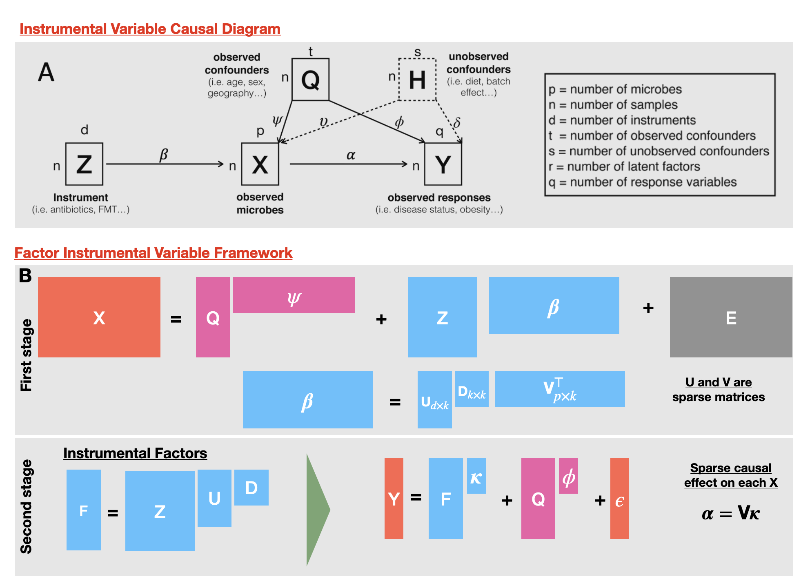

# Factor IV: Instrumental factor models for causal inference in high-dimensional multi-omics data

This repository hosts the full research workflow, simulations, and real-data applications for the **Factor‑IV** methodology:  
a high‑dimensional instrumental variable (IV) framework designed for high-dimensional causal inference in multi-omics data.

The project contains three major components to provide the overall conceptual architecture, methodology, study design, and guidance for navigating the repository:

1. **Simulation Study**  
2. **HCC Metabolome–Microbiome Application**  
3. **DIABIMMUNE Multi-omics Application**


---

# 1. Methodological Overview
Factor‑IV is a *latent factor–based* instrumental variable method designed for:
- High‑dimensional mediators (microbiome, metabolomics, gene expression)  
- Correlated instruments (diet, clinical variables, exposures)  
- Strong confounding and endogeneity  
- Non‑Gaussian data (Gaussian, NB count‑based outcomes)


**Figure 1. Conceptual overview of the Factor–IV framework.**  
(A) Classical instrumental variable (IV) setting for microbiome data, where exogenous perturbations influence high-dimensional microbial features in the presence of observed and unobserved confounding.  
(B) Factor–IV approach, which constructs instrument-aligned latent factors via a sparse low-rank first stage and estimates structured causal effects as $\boldsymbol{\alpha} = \mathbf{V}\boldsymbol{\kappa}$ in the second stage.


The model assumes (schematically):

```math
X = ZB + QC + \varepsilon, \qquad
Y = X\alpha + Q\eta + \delta
```
where  
- $X$: high‑dimensional mediators  
- $Y$: phenotype/outcome  
- $Z$: instruments  
- $Q$: confounders or covariates  
- $B = UDV^\top$: latent factorization  
- $U,V$: instrument and mediator loading matrices  
- $\alpha$: causal effect vector  
- $(\varepsilon,\delta)$: error terms possibly correlated to induce endogeneity


The Factor‑IV algorithm estimates:
1. **Latent factors** \(U, V\)  
2. **Reduced‑rank instrument–mediator structure**  
3. **Low‑dimensional IV projections**  
4. **Valid causal effects** via generalized method of moments (GMM) / ivprobit.

The method handles:
- Gaussian or Negative Binomial mediators  
- Unobserved confounding  
- Correlated errors (endogeneity)  
- Sparse loading structure


---

# 2. Simulation Study

Folder: `Simulation/`

### Purpose
To evaluate the performance of Factor‑IV vs naïve OLS under:
- Different SNR settings  
- Different endogeneity mechanisms  
- Gaussian vs NB outcome settings  
- Varying dimensionality \(n,d,m,k\)

### Files
- `simulate_data.R` — core simulation engine  
- `SimulationStudy.Rmd` — main driver  
- `output/` — saved model fit objects  
- `plots/` — comparison figures

### Key Components
- Endogeneity via **correlated error** or **unobserved confounder**
- Signal scaling to achieve target SNR values
- Comparison metrics:
  - RMSE of α  
  - R² of estimated vs true α  
  - Scatter plots (facet‑based)
  - Instrument strength diagnostics

A dedicated README inside the `/Simulation/` folder explains details.

---

# 3. HCC Application (MD Anderson mouse cohort)

Folder: `HCCAnalysis/`

### Data sources
Metabolomics, 16S, and metadata from **MD Anderson**.

### Workflow
1. **Data Prep**  
   Scripts: `HCCAnalysis/scripts/dataPrep_md_otu.R`, `HCCAnalysis/scripts/dataPrep_metabolitesGNP.R`  
   Standardizes IDs, builds instruments (treatment/diet/antibiotics), controls (age/weight/strain), encodes phenotypes, and CLR-transforms OTUs/metabolites.

2. **Model Fitting**  
   Script: `HCCAnalysis/scripts/microb_metabolites_otu.R`  
   Loads a prefit GOFAR object (`output/microb_metabolites_full_otu_wsd1.RData`), derives latent scores, runs IV‑probit for causal effects, and exports plots/Excel outputs. Uncomment the GOFAR fit block to refit.

3. **Outputs**
   - `HCCAnalysis/plots/*.pdf` (latent balances, instrument contributions, causal heatmaps)  
   - `HCCAnalysis/output/microb_metabolites_analysis.xlsx`, `causal_effect_mtb.xlsx`, `metabolites_annotation.xlsx`

See `HCCAnalysis/README.md` for details.

---

# 4. DIABIMMUNE Application

Folder: `Diabimmune/`

### Data Sources
Longitudinal 16S + metagenomics + autoimmunity phenotypes.

### Workflow
1. **Data Preparation** — `Diabimmune/dataPrep_diabimmune.R`  
   Harmonizes metadata/ontology, defines age windows (0–12, 12–24, >24 months), and saves matched objects.

2. **Microbiome Modeling** — `Diabimmune/microb_diabimmune.R`  
   Fits GOFAR latent factors for metagenomics and 16S per age window (`index_select` 1–3), then IV‑probit for causal effects.

3. **Figure Generation** — `Diabimmune/compile_figure_diabimmune.R`  
   Heatmaps, instrument contribution barplots, and latent factor boxplots. Expects causal‑effect RData available at the load paths noted in the Diabimmune README.

Plots are stored in `Diabimmune/plots/`. See `Diabimmune/README_Diabimmune.md` for run notes and path expectations.

---

# 5. Repository Structure

```
ProjectRoot/
│
├── Simulation/
│   ├── simulate_data.R
│   ├── SimulationStudy.Rmd
│   ├── output/
│   ├── plots/
│   └── README_simulation.md
│
├── HCCAnalysis/
│   │── dataPrep_md_otu.R
│   │── dataPrep_metabolitesGNP.R
│   │── microb_metabolites_otu.R
│   ├── output/
│   ├── plots/
│   └── README.md
│
├── Diabimmune/
│   ├── dataPrep_diabimmune.R
│   ├── microb_diabimmune.R
│   ├── compile_figure_diabimmune.R
│   ├── output/
│   ├── plots/
│   └── README_Diabimmune.md
│
└── README.md  ← (this file)
```

---

# 6. Citation
If you use this repository, please cite:

> **Mishra & Collaborators**,  
> *High-Dimensional Instrumental Variable Modeling for Multi-Omics Causal Inference*,  
> UGA Working Paper, 2025.

---

# 7. Contact
For questions, email: **aditya.mishra@uga.edu**  
Dept. of Statistics, University of Georgia  
